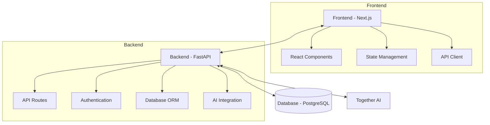

# Architecture Overview

## System Architecture

## Core Dependencies

### Backend
- **FastAPI**: Web framework for building APIs
- **SQLAlchemy**: ORM for database operations
- **Alembic**: Database migrations
- **Python-Jose**: JWT token handling
- **Pydantic**: Data validation and settings management
- **Uvicorn**: ASGI server

### Frontend
- **Next.js 14**: React framework
- **TypeScript**: Type-safe JavaScript
- **Tailwind CSS**: Utility-first CSS framework
- **SWR**: Data fetching
- **React Hook Form**: Form handling
- **Axios**: HTTP client

### AI/ML
- **Together AI**: LLM provider
- **Llama 3**: Primary language model
- **Sentence Transformers**: For embeddings

## Data Flow

1. User interacts with the frontend
2. Frontend makes authenticated requests to backend
3. Backend processes request and interacts with database/AI
4. Response sent back to frontend
5. UI updates based on response
