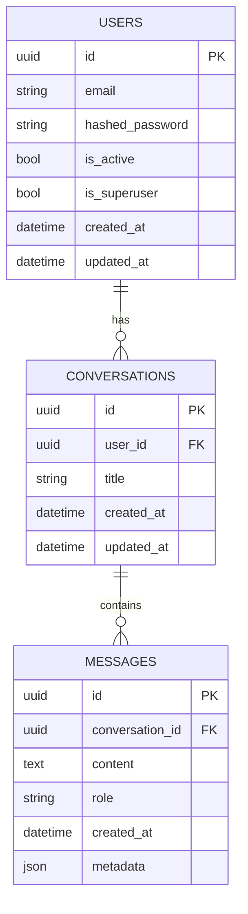

# Database Schema

## Entity Relationship Diagram



## Tables

### Users
Stores user account information.

| Column | Type | Constraints | Description |
|--------|------|-------------|-------------|
| id | UUID (PK) | PRIMARY KEY | Unique user identifier |
| email | String | UNIQUE, NOT NULL | User's email address |
| hashed_password | String | NOT NULL | Hashed password |
| is_active | Boolean | DEFAULT true | Whether the user is active |
| is_superuser | Boolean | DEFAULT false | Admin privileges |
| created_at | DateTime | NOT NULL | Account creation timestamp |
| updated_at | DateTime | NOT NULL | Last update timestamp |

### Conversations
Stores conversation threads.

| Column | Type | Constraints | Description |
|--------|------|-------------|-------------|
| id | UUID (PK) | PRIMARY KEY | Unique conversation ID |
| user_id | UUID (FK) | FOREIGN KEY | Owner of the conversation |
| title | String | NOT NULL | Conversation title |
| created_at | DateTime | NOT NULL | Creation timestamp |
| updated_at | DateTime | NOT NULL | Last update timestamp |

### Messages
Stores individual messages within conversations.

| Column | Type | Constraints | Description |
|--------|------|-------------|-------------|
| id | UUID (PK) | PRIMARY KEY | Unique message ID |
| conversation_id | UUID (FK) | FOREIGN KEY | Parent conversation |
| content | Text | NOT NULL | Message content |
| role | String | NOT NULL | 'user' or 'assistant' |
| created_at | DateTime | NOT NULL | Creation timestamp |
| metadata | JSON | NULL | Additional message data |

## Indexes

- `idx_users_email`: On `users(email)` for fast login lookups
- `idx_messages_conversation_id`: On `messages(conversation_id)` for fetching conversation history
- `idx_conversations_user_id`: On `conversations(user_id)` for user's conversation list

## Relationships

- One-to-Many: User -> Conversations
- One-to-Many: Conversation -> Messages

## SQLAlchemy Models

### User Model
```python
class User(Base):
    __tablename__ = "users"
    
    id = Column(UUID(as_uuid=True), primary_key=True, index=True)
    email = Column(String, unique=True, index=True, nullable=False)
    hashed_password = Column(String, nullable=False)
    is_active = Column(Boolean, default=True)
    is_superuser = Column(Boolean, default=False)
    created_at = Column(DateTime, default=datetime.utcnow)
    updated_at = Column(DateTime, default=datetime.utcnow, onupdate=datetime.utcnow)
    
    conversations = relationship("Conversation", back_populates="user")
```

### Conversation Model
```python
class Conversation(Base):
    __tablename__ = "conversations"
    
    id = Column(UUID(as_uuid=True), primary_key=True, index=True)
    user_id = Column(UUID, ForeignKey("users.id"), nullable=False)
    title = Column(String, nullable=False)
    created_at = Column(DateTime, default=datetime.utcnow)
    updated_at = Column(DateTime, default=datetime.utcnow, onupdate=datetime.utcnow)
    
    user = relationship("User", back_populates="conversations")
    messages = relationship("Message", back_populates="conversation")
```

### Message Model
```python
class Message(Base):
    __tablename__ = "messages"
    
    id = Column(UUID(as_uuid=True), primary_key=True, index=True)
    conversation_id = Column(UUID, ForeignKey("conversations.id"), nullable=False)
    content = Column(Text, nullable=False)
    role = Column(String, nullable=False)  # 'user' or 'assistant'
    created_at = Column(DateTime, default=datetime.utcnow)
    metadata = Column(JSON, nullable=True)
    
    conversation = relationship("Conversation", back_populates="messages")
```

## Migrations
Migrations are managed using Alembic. To create a new migration:

```bash
alembic revision --autogenerate -m "description of changes"
alembic upgrade head
```

## Notes
- All tables use UUIDs as primary keys
- Timestamps are in UTC
- Soft deletes are not implemented but could be added by adding an `is_deleted` flag
