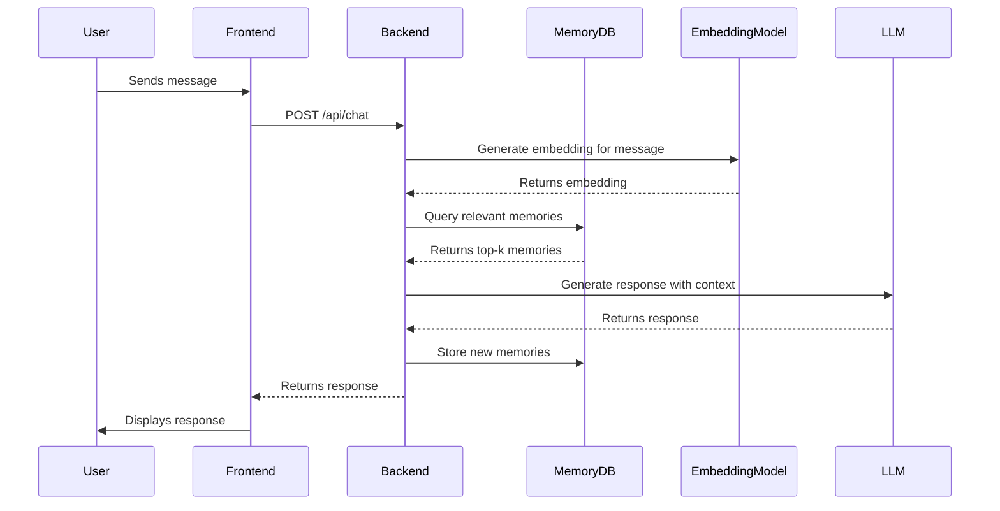

# Memory System Design

## Overview
The memory system enables the AI to maintain context across conversations by storing and retrieving relevant information based on the current conversation context.

## Core Components

### 1. Memory Storage
- **Type**: Vector database (ChromaDB)
- **Schema**:
  - `id`: Unique identifier (UUID)
  - `user_id`: Owner of the memory
  - `content`: The actual memory content
  - `embedding`: Vector embedding of the content
  - `metadata`: Additional context (timestamps, source, etc.)
  - `created_at`: When the memory was created
  - `last_accessed`: When the memory was last retrieved

### 2. Memory Retrieval
- **Semantic Search**: Uses cosine similarity on embeddings
- **Recency Boost**: More recent memories get higher relevance
- **Relevance Threshold**: Minimum similarity score to consider a memory relevant

### 3. Memory Types
1. **Conversation Memory**
   - Stores message history
   - Used for short-term context

2. **Fact Memory**
   - Stores user-provided facts
   - Persists across conversations

3. **Procedural Memory**
   - Stores learned procedures
   - Used for task automation

## Data Flow



## Implementation Details

### Embedding Generation
- **Model**: `all-MiniLM-L6-v2` (default)
- **Vector Size**: 384 dimensions
- **Normalization**: L2 normalization for cosine similarity

### Memory Storage
```python
class Memory(Base):
    __tablename__ = "memories"
    
    id = Column(UUID(as_uuid=True), primary_key=True)
    user_id = Column(UUID, ForeignKey("users.id"), nullable=False)
    content = Column(Text, nullable=False)
    embedding = Column(Vector(384))  # Vector type from pgvector
    metadata = Column(JSON, default={})
    created_at = Column(DateTime, default=datetime.utcnow)
    last_accessed = Column(DateTime, default=datetime.utcnow)
    
    # For full-text search
    __ts_vector__ = create_tsvector('english', content)
    __table_args__ = (
        Index('idx_memory_fts', __ts_vector__, postgresql_using='gin'),
    )
```

### Memory Retrieval
```python
def get_relevant_memories(
    db: Session,
    user_id: UUID,
    query_embedding: List[float],
    limit: int = 5,
    threshold: float = 0.7
) -> List[Memory]:
    """Retrieve memories most relevant to the query embedding."""
    return db.query(Memory).filter(
        Memory.user_id == user_id,
        Memory.embedding.cosine_distance(query_embedding) < (1 - threshold)
    ).order_by(
        Memory.embedding.cosine_distance(query_embedding)
    ).limit(limit).all()
```

## Future Enhancements

### Short-term (Next Release)
- [ ] Implement memory importance scoring
- [ ] Add memory consolidation (similar memories merging)
- [ ] Support memory editing/deletion

### Medium-term
- [ ] Implement memory hierarchies
- [ ] Add temporal context awareness
- [ ] Support for different memory retrieval strategies

### Long-term
- [ ] Multi-modal memory support
- [ ] Cross-user memory sharing
- [ ] Memory versioning and provenance

## Performance Considerations

### Indexing
- Vector index for fast similarity search
- B-tree index on `user_id` for user-specific queries
- GIN index for full-text search

### Caching
- LRU cache for frequently accessed memories
- Batch embedding generation
- Asynchronous memory updates

## Security
- Strict user isolation for memory access
- Encryption at rest for sensitive memories
- Audit logging for memory access

## Monitoring
- Track memory hit/miss rates
- Monitor retrieval latency
- Log memory-related errors
