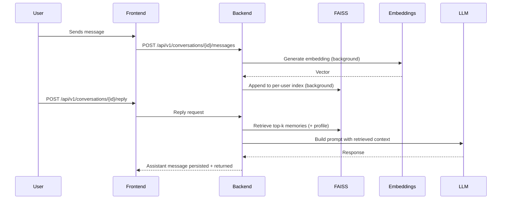

# Memory System Design

## Overview
The memory system enables the AI to maintain context across conversations by storing and retrieving relevant information based on the current conversation context.

## Core Components

### 1. Memory Storage
- **Type**: FAISS-backed vector store (local, per-user shards)
- **Source of truth**: Application DB for messages, onboarding, and metadata; FAISS stores vectors only
- **Files**:
  - `data/faiss/{user_id}.index`
  - `data/faiss/{user_id}.meta.json` (id ordering and lightweight metadata)

### 2. Memory Retrieval
- **Semantic Search**: Uses cosine similarity (IndexFlatIP) on normalized embeddings
- **Recency Boost**: Prefer recent nodes when scores tie
- **Relevance Threshold**: Configurable minimum similarity score
- **Profile Seed**: Always include “profile memory” (onboarding summary)

### 3. Memory Types
1. **Conversation Memory**
   - Stores message history
   - Used for short-term context

2. **Fact Memory**
   - Stores user-provided facts
   - Persists across conversations

3. **Procedural Memory**
   - Stores learned procedures
   - Used for task automation
4. **Profile Memory (central hub)**
   - Synthesized onboarding summary kept up-to-date; acts as the center node of the web

## Data Flow

## Implementation Details

### Embedding Generation
- **Model**: `all-MiniLM-L6-v2` (default)
- **Vector Size**: 384 dimensions
- **Normalization**: L2 normalization for cosine similarity

### Memory Store (FAISS)
- Index: `IndexFlatIP` per user (CPU)
- Persistence: disk files in `FAISS_DATA_DIR`
- Operations:
  - `add(user_id, ids[], vectors[])`
  - `search(user_id, query_vector, top_k)`
- Deletes: mark-delete in meta and rebuild shard periodically (later)

### Retrieval
- Seed: top-k by FAISS for the current query + profile memory
- Optional expansion (future): 1–2 hops via graph edges
- Rerank: similarity + recency + importance (future)

## Future Enhancements

### Short-term (Next Release)
- [ ] Implement memory importance scoring
- [ ] Add memory consolidation (similar memories merging)
- [ ] Support memory editing/deletion
- [ ] Reply endpoint with FAISS retrieval + Together model

### Medium-term
- [ ] Implement memory hierarchies (spiderweb graph)
- [ ] Add temporal context awareness
- [ ] Support for different memory retrieval strategies

### Long-term
- [ ] Multi-modal memory support
- [ ] Cross-user memory sharing
- [ ] Memory versioning and provenance

## Performance & Cost Efficiency

### Indexing
- FAISS for fast similarity search
- Per-user shards for isolation and cache locality

### Caching & Batching
- LRU cache for recent retrievals per conversation
- Batch embedding generation
- Asynchronous memory updates

### Token & Inference Cost
- Summarize long memories and clamp context window
- Strict token budgets and top-k limits
- Use Together `meta-llama/Llama-3.3-70B-Instruct-Turbo-Free` by default; allow env‑based switching

## Security
- Strict user isolation for memory access
- Encryption at rest for sensitive memories
- Audit logging for memory access

## Monitoring
- Track memory hit/miss rates
- Monitor retrieval latency
- Log memory-related errors
 - Track token usage and per-feature inference costs
